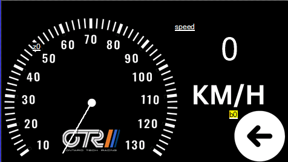

# ESP32-Based Dashboard with Nextion Display and Web Portal

## Overview
This project is an embedded system using an ESP32 microcontroller to communicate with a Nextion display and host a web-based dashboard. The dashboard provides real-time updates of various sensor values and displays them on both the Nextion display and a dynamic web page. 

The ESP32 acts as both a controller and a web server, creating its own Wi-Fi network, sending data to the Nextion display via UART, and serving a web page with real-time updates using AJAX.

## Features
- **Standalone Wi-Fi Network:** The ESP32 creates a Wi-Fi network named "OTR DASH" for accessing the web-based dashboard without the need for an internet connection.
- **UART Communication:** The ESP32 communicates with the Nextion display using UART at a baud rate of 38400.
- **Dynamic Webpage:** The ESP32 hosts a real-time web-based dashboard that updates sensor data without page refreshes, using AJAX and JSON.
- **Simulated Sensor Values:** For testing purposes, sensor values are incremented at regular intervals and displayed accordingly.

## Display Structure

### Nextion Display Pages
#### Page 0 (Primary Dashboard)
- **Gauge Angle (`page0.z0.val`):** Represents the speedometer on the display. Calculated as `315 + (1.04 * speed)`. If the calculated angle exceeds 360, it wraps around by subtracting 360.
- **Battery Temperature (`page0.batteryTemp.txt`):** Shows the current temperature of the battery in Celsius.
- **Acceleration (`page0.acceleration.txt`):** Displays the current acceleration in m/s².

#### Page 1 (Detailed Sensor Data)
- **Torque (`page1.torque.txt`):** Displays the current torque in Nm.
- **Battery Temperature (`page1.batteryTemp.txt`):** Same as on Page 0, showing the battery temperature.
- **Latitude (`page1.latitude.txt`):** Displays the current latitude position.
- **Longitude (`page1.longitude.txt`):** Displays the current longitude position.
- **Acceleration (`page1.acceleration.txt`):** Displays acceleration, same as on Page 0.
- **Current (`page1.current.txt`):** Displays the current drawn by the system in amps.
- **Voltage (`page1.voltage.txt`):** Displays the voltage of the battery in volts.

### Web-Based Dashboard
The web-based dashboard displays the same sensor values as the Nextion display, with updates every second. The values are fetched using AJAX calls to the `/sensorData` endpoint and updated in real-time.

#### AJAX Logic
- The webpage runs a JavaScript function that periodically (every second) sends a request to the ESP32 for the latest sensor values.
- The ESP32 responds with a JSON-formatted string containing the current sensor data.
- The JavaScript then updates the corresponding HTML elements on the page, creating a seamless real-time experience without the need for page reloads.

### Algorithms and Logic
1. **Gauge Angle Calculation:**
   - The speed value is converted to a gauge angle using the formula: `315 + (1.04 * speed)`.
   - If the calculated angle exceeds 360, the code subtracts 360 to keep it within a valid 0-360° range.
   - The angle is cast to an integer before being sent to the Nextion display, as the display requires integer values for angle representation.

2. **JSON Data Handling for Web Portal:**
   - The ESP32 generates a JSON string containing all the sensor data values.
   - This string is sent to the client when it makes an AJAX request to the `/sensorData` endpoint.
   - The client’s JavaScript updates the HTML elements dynamically, enabling a real-time dashboard experience.

3. **Wi-Fi Access Point:**
   - The ESP32 starts as a Wi-Fi access point, broadcasting the SSID "OTR DASH".
   - This allows any Wi-Fi-enabled device to connect to the network and access the web-based dashboard.

4. **UART Communication with Nextion Display:**
   - The ESP32 sends updates to the Nextion display using standard UART communication.
   - Commands are sent as strings, followed by three `0xFF` bytes, as required by the Nextion communication protocol.

## Dependencies
Ensure that the following libraries are installed in the Arduino IDE:
- **ESPAsyncWebServer**
- **AsyncTCP**

These libraries are essential for the asynchronous web server functionality.

## How to Use
1. **Connect to Wi-Fi:**
   - On a Wi-Fi-enabled device, connect to the "OTR DASH" network.
2. **Access the Web Portal:**
   - Open a web browser and enter the ESP32’s IP address (displayed on the serial monitor).
3. **Monitor Real-Time Data:**
   - The webpage will display the latest sensor values, updating every second.
4. **View on Nextion Display:**
   - The sensor values will also be visible on the Nextion display, with speed represented as a gauge.

## Future Improvements
- Integrate real sensor data from connected hardware.
- Add support for more detailed graphics and charts on the web-based dashboard.
- Implement error handling for sensor communication and data transmission.

## License
This project is licensed under the MIT License.

## Author
Developed by Jaspartap Goomer. If you have any questions or suggestions, feel free to reach out.

